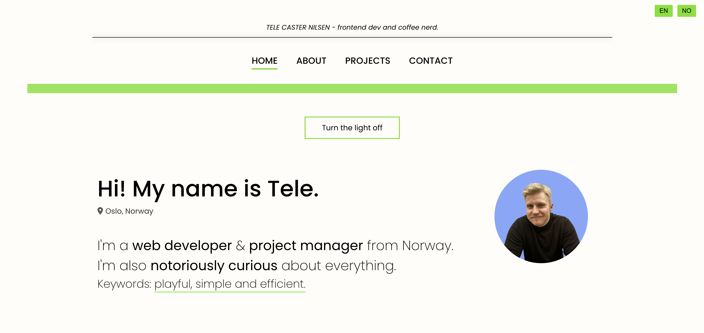

# Hi! 👾 I'm Tele and this is my website

**Live site:** [telecasteren](https://telecasternilsen.com)

## The build

I'm a fan of keeping things simple, so this site is built on good old vanilla Javascript, HTML and CSS. The translations are straightforward and kept [here](resources/translations), since the site itself is very small I haven't used any translation libraries. You'll find the translator function [here](js/app/utils/translation/translator.js).

### My work

Trained in frontend, but too curious to not go for fullstack. I love solving problems that help others, hence being drawn towards the user experience and frontend, but I don't like to restrict myself and I find working with the full stack very exciting. 

**Focused technologies:**

- Typescript/Javascript
- HTML / CSS
- MYSQL / SQL

- Next.js
- Express.js

- React
- Tanstack
- Tailwind
- MUI

**Tools**

- Prisma
- Neon
- Docker
- Bunny Storage
- Firebase
- Vercel

### Contact

#### Email: 

- [Send me a message here](https://telecasternilsen.com/#contact)
- Here's my email: nilsen.tele@proton.me

#### Else:

- [GitHub profile](https://github.com/telecasteren)
- [LinkedIn profile](https://www.linkedin.com/in/tele-caster-nilsen-7002b9249/)
