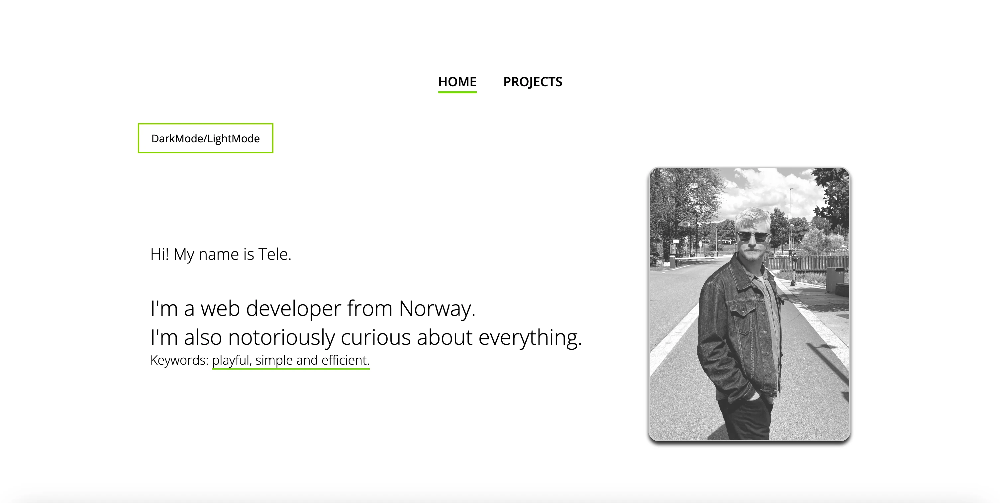

# Tele Caster Nilsen's portfolio

**Live site:** [telecasteren](https://telecasteren.github.io/)

## Description

I'm Tele Caster Nilsen and this is my portfolio. 
Whilst showcasing three of my bigger website projects, the portfolio itself also is built entirely by me.

**Projects showcased on site:**

- Unwired - [unwired]()
- Gamehub - [gamehub]()
- Community Science Museum - [communitysciencemuseum]()

## Portfolio built with

I build websites with **Visual Studio Code** and **Git**. 
And I tend to experiment with different methods of deployment, in this case the site is deployed with Github pages.

**Languages:** 

- Javascript, HTML and CSS

### Contact:

- [My website - telecasternilsen](https://telecasternilsen.netlify.app/)
- [GitHub profile](https://github.com/telecasteren)
- [LinkedIn profile](https://www.linkedin.com/in/tele-caster-nilsen-7002b9249/)
