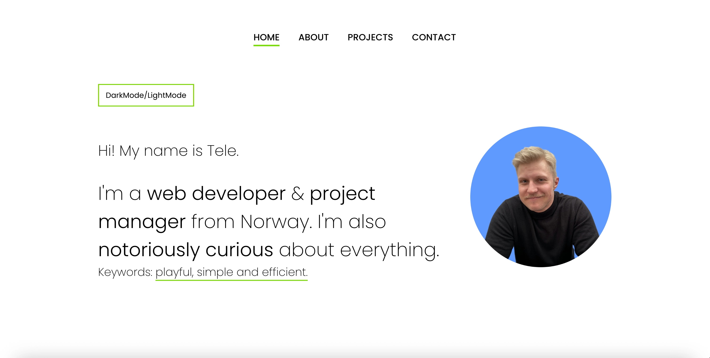

# Tele Caster Nilsen's portfolio



**Live site:** [telecasteren](https://telecasteren.github.io/)

## Description

I'm Tele Caster Nilsen and this is my portfolio.<br/>
In addition to showcasing some of my projects, the portfolio itself also is built entirely by me.

**Projects showcased on site:**

- Foodiegram - [the code](https://github.com/telecasteren/social-app-noroff)
- Unwired - [live site](https://unwired.netlify.app/)
- Gamehub - [live site](https://gamehub-tele.netlify.app/)
- Community Science Museum - [live site](https://telecasteren-semester1.netlify.app/)

## The build

This portfolio is deployed with Github pages.

**Languages:**</br>

- Vanilla Javascript, HTML and CSS

## Run this project

You can clone the github repo and run it locally on your machine with a Live server extension.

```bash
git clone git@github.com:telecasteren/telecasteren.github.io
```

### Contact:

Email:</br>

- [telecasteren](https://telecasteren.github.io/#contact)

Else:

- [GitHub profile](https://github.com/telecasteren)
- [LinkedIn profile](https://www.linkedin.com/in/tele-caster-nilsen-7002b9249/)
